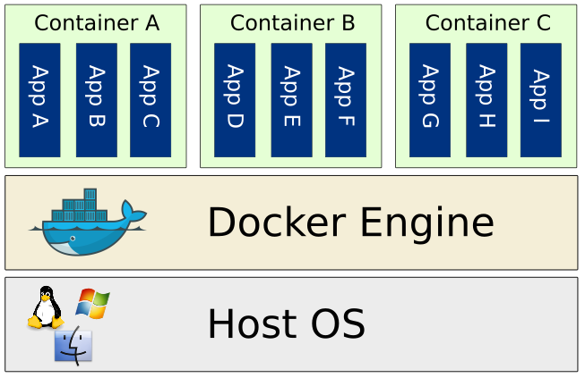
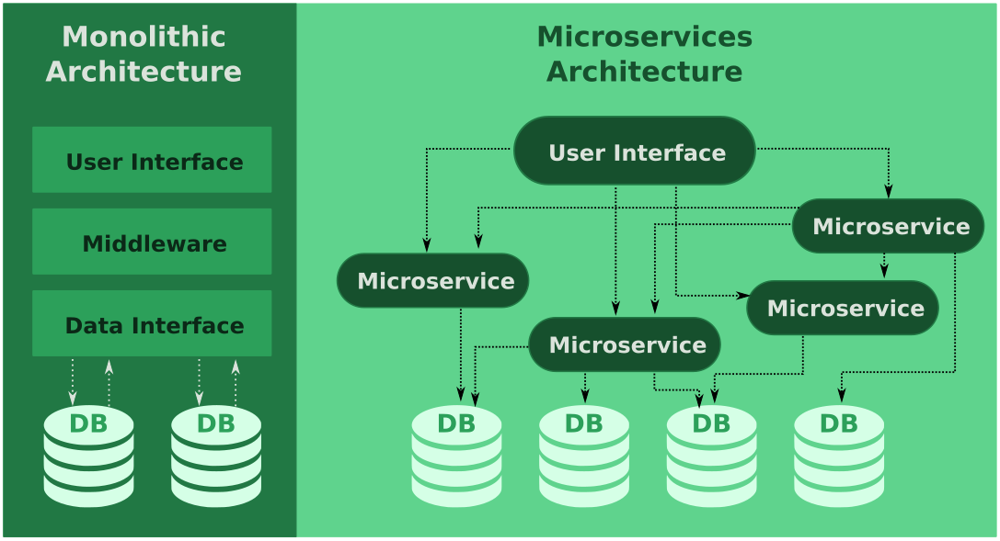
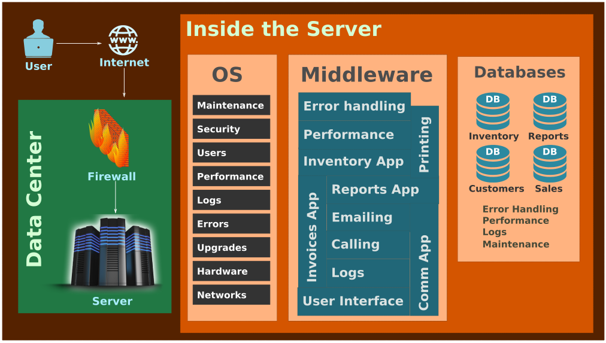

# Introduction

## Containers

Containers are an Operative System Virtualization technology that allows you to package (containerize!) applications and services, dependencies, and configurations in Isolated environments. 

-  **Portability**: Standardize your environment across   different infrastructures allowing developers to deploy applications with little to no modification.
-  **Isolation**: Isolate applications from each other on a shared OS providing more security and avoiding dependency problems.
-  **Agility**: Have a much smaller footprint by using the Host OS resources, allowing to start/stop services faster. 
-  **Scalability**: Allows you to increase the number of replicas running of a container.

Containers are created from container images that act like templates that hold all the required information for a container to run. Images are created in layers in which 1 image can be used to run multiple containers or also to create another more complex image that then can be used to run multiple containers. 

Containers do not care what you ship in it: It can be built into your laptop and be deployed on the cloud on the other side of the world; it is interchangeable, stackable, portable, and as generic as possible.

## Virtual Machines

Virtual machines are based on computer architectures and provide the functionality of a physical computer. Their implementations may involve specialized hardware, software, or a combination. They provide a substitute for a real machine. They provide the functionality needed to execute entire operating systems. A hypervisor uses native execution to share and manage hardware, allowing for multiple environments which are isolated from one another, yet exist on the same physical machine

## Monolithic Architecture

Monolithic Architecture puts complex applications that solve multiple problems and have multiple functions into a single environment, workspace, and much larger codebases. 

**Advantages:**

- It is simple to develop as there is either no modularity or less formal modularity.
- It is easy to deploy as one single file is deployed.
- There are fewer security concerns as software consists of a single codebase.
- Because of the single code base, there is no network latency, so the application has better performance.
- It is easy to track bugs and do end-to-end testing because of the single codebase.

**Disadvantages:**

-  When a bug affects a single aspect of the code base, it impacts everything!!!.
-  Even if a small change is required, the whole application needs to be redeployed.
-  Thorough regression testing is required even if a small change is made.
-  You cannot scale the components; you have to scale the whole application.  
-  If you want to use new technology, you have to re-write the whole application.
-  As code base size increases, it becomes difficult to manage code and overall deployment time also increases.
-  If a new developer joins the project, it is not very easy for him to understand the code and work-flows.

## Micro-services Architecture

In a Micro-services architecture, you create smaller applications deployed independently as loosely coupled services and tied together through application integration.  The business logic may encompass multiple platforms, including software and databases from multiple sources. From a developer perspective, micro-services are simpler to develop, smaller, and faster to deploy. Which allows continuous integration and delivery of `CI/CD.` They can be written in any programming language and can communicate with other micro-services through `APIs.`

-  **Continuous Integration CI:** Is the process of automating the build and testing of code.
-  **Continuous Delivery CD:** Is the ability to automate the deployment process of an application.
-  **Application Programming Interface APIs:** Is a set of calls programmed to make use of a service or application.

## Architectures comparison

### A simplified example

The above is the type of representation that you might find all over the internet. We indicate that in Monolithic Architecture, everything is interdependent and connected. There is a `two-way` communication while in the Microservices Architecture, everything is loose, and the communication comes and goes in different directions and across components.

### A more realistic example

Imagine you are developing the code for a web application used by a shoe store that requires:

-  Creating invoices
-  Maintaining inventory
-  Creating reports
-  Customer communications

#### Monolithic Architecture

In a monolithic architecture, the infrastructure along with the application in an oversimplified example that is using a single server might look something like this:

#### Micro-service Architecture

The same application in a micro-service architecture will look something like this:

Notice how all the dependencies regarding the location, server, operative system, language, and database no longer exist. The re-utilization of services is broader and easier by communicating among services using APIs.

## Twelve-Factors of SaaS

The twelve-factor application is a methodology for building software-as-a-service applications that:

-  Use **declarative** formats for setup automation to minimize time and cost for new developers joining the project;
-  Offering **maximum portability** between execution environments;
-  Are suitable for **deployment** on modern **cloud platforms**, obviating the need for servers and systems administration;
-  **Minimize divergence** between development and production, enabling **continuous deployment** for maximum agility;
-  And can **scale-up** without significant changes to tooling, architecture, or development practices.

The twelve-factor methodology can be applied to applications written in any programming language and any combination of backing services.

1. **Codebase**: One Codebase tracked in revision control, many deploys.
2. **Dependencies**: Explicitly declare and isolate dependencies.
3. **Config**: Store config in the environment.
4. **Backing services**: Treat backing services as attached resources.
5. **Build, release, run**: Strictly separate build and run stages.
6. **Processes**: Execute the app as one or more stateless processes.
7. **Port binding**: Export services via port binding.
8. **Concurrency**: Scale-out via the process model.
9. **Disposability**: Maximize robustness with fast startup and graceful shutdown.
10. **Dev/prod parity**: Keep development, staging, and production as similar as possible.
11. **Logs**: Treat logs as event streams.
12. **Admin processes**: Run admin/management tasks as one-off processes.

# Introducing Containers

Containers make development efficient and predictable, take away repetitive, mundane configuration tasks, and are used throughout the development life-cycle for fast, easy, and portable application development.

It works by using an open-source engine that automates the deployment of applications into containers that can be either Podman or docker among the most known ones.

## Advantages

### Isolation & Security

Using containers, developers can create predictable environments isolated from other applications. Regardless of where the application is deployed, everything remains consistent, and this leads to massive productivity:  less time debugging and more time launching fresh features and functionality for users.

From a security point of view, containers ensure that running applications are completely segregated and isolated from each other,  granting you complete control over traffic flow and management. None of the containers can look into processes running inside another container. From an architectural point of view, each container gets its own set of resources ranging from processing to network stacks.

### Resource Utilization

When each process is put into a container, it can be shared with new applications. Allowing containers to share essential kernel functions removes unnecessary OS overhead allowing for up to four times more server application instances in the space a Virtual Machine would need. 

Containers are also quicker than a virtual machine as they do not need to launch a complete Operative System.

### Manageability & Portability

Container images are free of environmental limitations, making any deployment consistent, portable, and scalable. Containers benefit from running anywhere, which speeds up the development process.  

### Scalability 

You can dictate how many resources `CPU, network, memory` each container can use. Plus, the containers can be resized to meet the needs of your application as it grows, which allows an application to scale better than those on virtual machines, which are difficult to resize.  

## Architecture

| Component     | Description                                                  |
| ------------- | ------------------------------------------------------------ |
| **Engine**    | Daemon + Client is referred to as the Engine or Master.        |
| **Client**    | It is the Command Line Interface or Command Line Interface (C. L. I.) that controls the Daemon. |
| **Daemon**    | Service responsible for running containers. "The server."   |
| **Images**    | The initial state of a container. "Template" that formats how each container will look like. |
| **Registry**  | It is a repository of all the images. It can be public (Docker Hub) or private. |
| **Container** | It is an instance of an image that is **running**!.            |

The Engine is everything basically when you say Docker, you are in reality referring to the Engine that acts as a client-server application with:

-  A server with a long-running daemon process `dockerd.`
-  APIs specify interfaces that programs can use to talk to and instruct the Docker daemon.
-  A command-line interface (CLI) client `docker.`

The CLI uses Docker APIs to control or interact with the Docker daemon through scripting or direct CLI commands. Many other Docker applications use the underlying API and CLI. The Daemon creates and manages Docker objects, such as images, containers, networks, and volumes/storage.

When you execute a command in the `Client,` the `daemon` interprets the command. It acts accordingly by connecting to the `Registry` to `pull` a new `image` or to `build` another image or maybe to `run` the image, among other things such as `push` to the registry again. This process continues over and over for all your services. 

## Under the hood facts

-  Docker is written in the `GO programming language`.
-  Docker natively uses the `libcontainer` libraries.
-  Docker uses a technology called `namespaces` to isolate the container’s file system, network, and processes.
-  Resources are also isolated. Each container has allocated individual CPU and Memory using `cgroups` from the Linux Kernel.
-  Docker uses `Copy-on-Write` file systems for fast and efficient storage. 
-  Docker sends all outputs from any channel to `stdout` for easy recollection and analysis.
